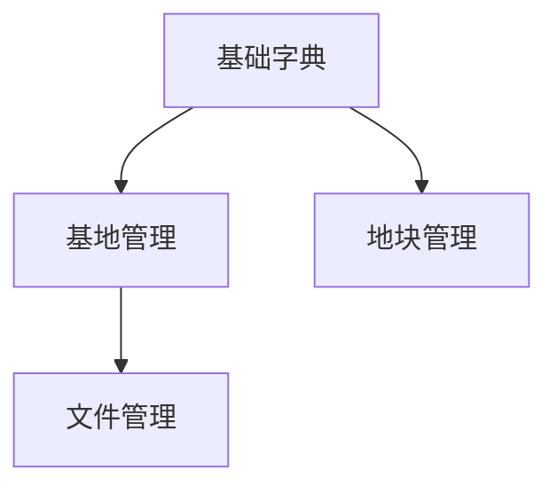

# 开发记录目录

本目录用于保存功能级、阶段级的设计与开发记录。每篇子文档都应能帮助后续开发者快速理解：为什么做、做了什么、涉及哪些仓库、如何验证、还有什么未完成。

## 文档命名

两套命名方式，视阶段而定：

### 阶段二（需求沟通与计划生成）产出

```text
{优先级}-{序号}-{模块}-{主题}.md

示例：
p0-01-base-基地管理.md
p0-02-plot-地块管理.md
p0-03-dict-基础字典.md
p1-04-doc-文件管理.md
```

- 前缀 `p0/p1/p2/p3` 表示优先级
- 序号在同优先级内连续
- `{模块}` 小写，对应权限码 `gap:{模块}:*`
- `{主题}` 中文，可读

### 开发期追加文档

```text
YYYY-MM-DD-模块或主题.md

示例：
2026-05-15-项目文档体系建设.md
2026-05-20-检测管理报告导出.md
```

## 子文档内容要求

基于 `TEMPLATE-功能设计与开发记录.md` 创建，必填区域：

- **基本信息**：日期、模块、状态、优先级、涉及仓库、涉及端、依赖关系、可并行标志、Git 分支名
- **需求背景**：解决什么业务问题、面向哪些角色
- **本次范围 / 不在本次范围**：明确边界
- **数据模型**：表/对象、字段、状态枚举归属（字典 or 枚举）
- **字典与状态**：声明每个状态字段走哪个分支（`dict-tag` or `statusName`）
- **接口设计**：路径、方法、权限码
- **页面与交互**：页面路径、主要能力
- **权限与菜单**：权限码、菜单层级
- **附件、导出与留痕**：策略说明
- **开发记录**：日期、仓库、变更内容
- **验证记录**：日期、验证方式、结果
- **提交记录**：仓库、分支、提交信息（`{类型}: {模块}: {简述}`）、提交哈希
- **遗留事项**

## 依赖与并行标记

每篇子文档"基本信息"区必须包含：

```markdown
| 依赖 | 例如：p0-03-dict-基础字典（字典先行）；无依赖填"无" |
| 可并行 | 是 / 否（依赖未就绪填"否"） |
```

依赖关系可在本文件文末用 mermaid 一图概览：



## 与总览文档的关系

- `docs/05-项目开发进度总览.md` 记录项目整体状态和模块状态
- 本目录记录每个功能或阶段的详细设计与开发过程
- 子文档完成或状态变化后，必须同步更新总览文档中的模块状态、最近变更和待确认事项

## 推荐流程

1. 开发前复制 `TEMPLATE-功能设计与开发记录.md`，建立本次功能子文档
2. 先补齐需求范围、涉及端、设计方案和验收标准
3. 开发过程中记录关键变更、表结构、接口、页面和权限
4. 开发完成后记录验证结果、提交信息和遗留事项（提交信息格式：`{类型}: {模块}: {简述}`）
5. 同步更新 `docs/05-项目开发进度总览.md`
6. 不保留零散临时流水账，所有记录都要能服务后续接手、验证和追溯
